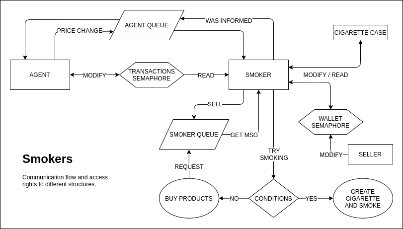

# Cigarette Smokers Problem
##### Concurrency library used ~ SYSTEM V IPC

[Source in polish](http://www.cs.put.poznan.pl/dwawrzyniak/PW/projekty.html#pieciu-kucharzy)

I assume here that the reader is familiar with the classic [problem](https://en.wikipedia.org/wiki/Cigarette_smokers_problem)
### Classic
The classic cigarette smokers problem assumes the role of an `Agent` as a dealer of goods for the `Smokers`.
`Agent` randomly chooses two of the three products and puts it on a table. It is up to the individual `Smoker`
to decide whether the pair displayed on the `table` (which btw. is probably a `shmseg`) suits him or not.
`Agent's` role then boils down to blocking the `table` during the change while `Smokers` have to stay idle
up until the moment the pair of products they need appears.
### Enhanced
As we've seen above, there's really not much going on there. A `semaphore` for the `table`, one `shmseg`,
to have store it's contents, and that's it. Let's look at the buffed-up version :)

#### Description
 - `Smokers` are buying products from each other at the current stock exchange price;
 - `Agent's` role is to randomly (both price, product and time interval) set the stock prices;
 - `Smokers` are not allowed to have nay debt, so at any given time their `wallet` cannot contain;
 negative value. They have to either wait for someone to buy from them or for the prices to go lower.
 They should also start with a wallet greater than zero, preferably greater than the maximum price
 which can be set by the `Agent` (which I'll try to explain later);
 - `Smoker` buys both products at the same time;
 - `msq` has to be used for transactions;

#### Technical overview of the solution

##### Agent
###### Structure
```c
struct Agent {
    int tobacco_price;
    int paper_price;
    int matches_price;
    int *smoker_queues;
    int *wallets;
    int text_color;
};
```
###### Important functions
```c
void set_price(struct Agent *agent);                            # set the randomized price for randomized product

void inform_smokers(int *msq_id, int product_type, int price);  # inform every smoker and make sure they've been informed

void block_all_wallets(int *wallets);                           # set a semaphore untill every smoker has been informed about the price change
```
##### Smoker
###### Structure
```c
struct Smoker {
    int id;
    int smoker_type;
    int agent_queue;
    int *prices;
    int *cigarette_case;
    int wallet_id;
    int *exchange_queues;
    int text_color;
};
```
###### Important functions
```c
void buy(struct Smoker *smoker);                # send buy requests to the respective smokers
    
void smoke(struct Smoker *smoker);              # smoke if the products needed to make a cig are in the cig case

void receive_message(struct Smoker *smoker);    # check exchange message queue for any messages - no priority, just pop
```
##### Message
```c
struct Msg {
    int type;
    struct Content {
        int sender_type;
        int wallet_id;
        int price;
        int product_type;
    }
};
```
#### Communication flow:
###### UML

###### Description
I will go here with an example cycle from a perspective of a `tobbaco` `Smoker`

Our `Smoker` starts with a certain ammount of money in his wallet. In each loop he does three things in a 
given order:
1. Check agent's message queue for price change info
2. Smoke, or at least try to. What happens here is that the `Smoker` checks if he has sufficeint products
to make a cig, If not he will check If he has money for both of the items and use `buy` to send requests to
the rest of the smokers.
3. Check his exchange queue for any messages and handle them accordingly. It can either `buy` request from
another smoker, `failed transaction`, which just means that the price was changed during the request and needs 
to be reevaluated or `sold` message with a requested item.
